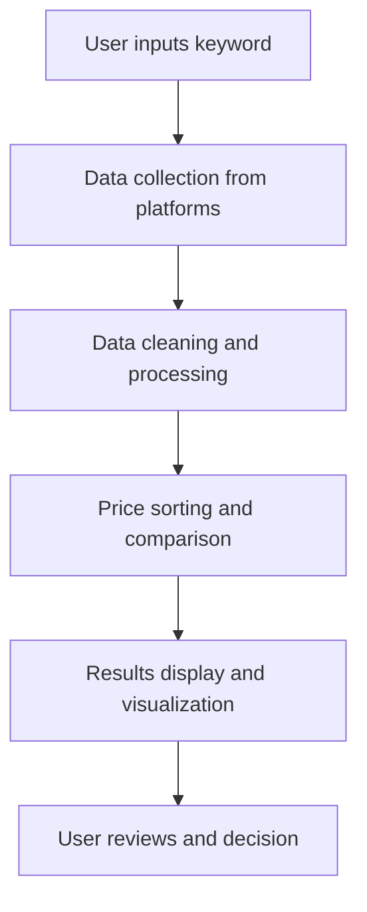

## 1. Product Overview
电商商品价格自动化采集与对比工具，用于从主流电商平台批量抓取商品信息并进行价格对比。
- 帮助用户快速获取同一商品在不同平台的价格信息，做出更明智的购买决策
- 为价格敏感型消费者和电商从业者提供数据支持

## 2. Core Features

### 2.1 User Roles
| Role | Registration Method | Core Permissions |
|------|---------------------|------------------|
| Normal User | No registration required | Use all features |

### 2.2 Feature Module
1. **Command-line tool**:商品信息采集、数据处理、结果输出
2. **Web interface**:关键词搜索、实时采集、数据可视化、结果展示

### 2.3 Page Details
| Page Name | Module Name | Feature description |
|-----------|-------------|---------------------|
| Web Interface | Search module | Input search keyword, select platforms, set search parameters |
| Web Interface | Results display | Show collected product information, sorted by price, with comparison features |
| Web Interface | Data visualization | Price trend charts, comparison graphs, cost-performance indicators |
| Command-line tool | Data collection | Scrape product info from JD, Taobao, Pinduoduo |
| Command-line tool | Data processing | Clean data, remove duplicates, sort by price |
| Command-line tool | Output | Generate structured results in JSON/CSV format |

## 3. Core Process
1. User inputs search keyword (e.g., "laptop")
2. Tool collects product data from multiple e-commerce platforms
3. Data is cleaned, deduplicated, and processed
4. Results are sorted by price and displayed with comparison features
5. User can view detailed information and make purchase decisions

## 4. User Interface Design
### 4.1 Design Style
- Primary color: #3B82F6 (blue)
- Secondary color: #10B981 (green)
- Accent color: #F59E0B (amber)
- Button style: Rounded corners, subtle shadow
- Font: Inter, sans-serif
- Layout style: Card-based, clean, minimal
- Icon style: Lucide React icons, simple and modern

### 4.2 Page Design Overview
| Page Name | Module Name | UI Elements |
|-----------|-------------|-------------|
| Web Interface | Search module | Search input field, platform checkboxes, search button, loading indicator |
| Web Interface | Results display | Product cards with image, name, price, platform, rating, link |
| Web Interface | Data visualization | Bar charts for price comparison, line charts for trends, radar charts for cost-performance |
| Command-line tool | Output | Structured text output, JSON/CSV files |

### 4.3 Responsiveness
- Desktop-first design
- Mobile-adaptive layout
- Touch optimization for mobile devices
- Responsive charts that resize based on screen width

### 4.4 3D Scene Guidance
Not applicable for this project