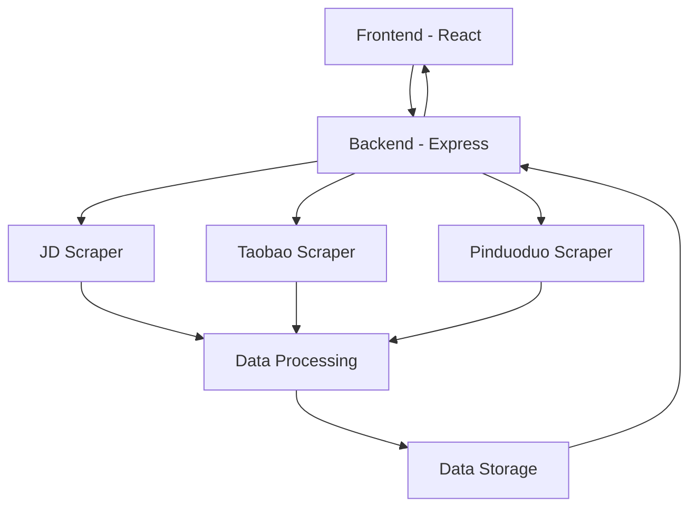
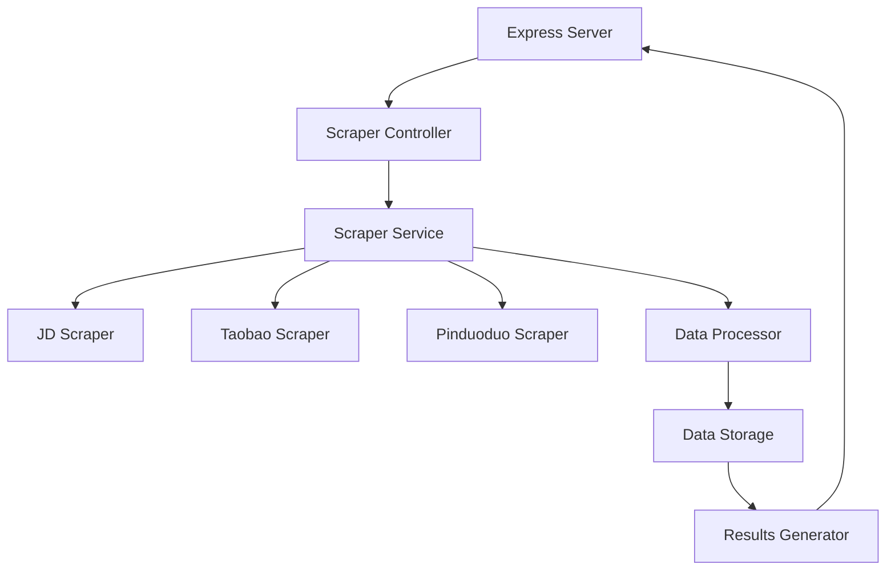
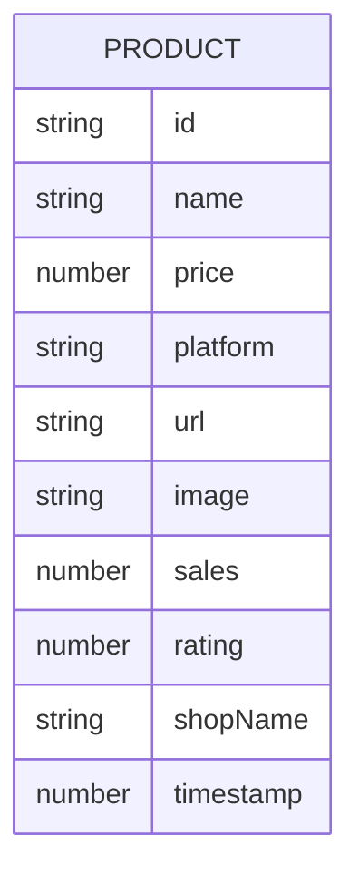

## 1. Architecture Design


## 2. Technology Description
- Frontend: React@18 + TailwindCSS@3 + Vite + Chart.js
- Initialization Tool: vite-init
- Backend: Express@4 + Node.js
- Database: In-memory storage (for demonstration) + JSON files
- Scraping: Puppeteer for dynamic content + Cheerio for static content
- Data Visualization: Chart.js

## 3. Route Definitions
| Route | Purpose |
|-------|---------|
| / | Web interface home page |
| /api/scrape | API endpoint for scraping product data |
| /api/results | API endpoint for retrieving results |

## 4. API Definitions
### 4.1 Scrape API
**Request:**
```typescript
interface ScrapeRequest {
  keyword: string;
  platforms: string[]; // ['jd', 'taobao', 'pdd']
  limit?: number; // optional, default 20
}
```

**Response:**
```typescript
interface ScrapeResponse {
  success: boolean;
  data?: Product[];
  error?: string;
}

interface Product {
  id: string;
  name: string;
  price: number;
  platform: string;
  url: string;
  image: string;
  sales?: number;
  rating?: number;
  shopName?: string;
  timestamp: number;
}
```

## 5. Server Architecture Diagram


## 6. Data Model
### 6.1 Data Model Definition


### 6.2 Data Definition Language
Not applicable for in-memory storage. For production implementation with database:

```sql
CREATE TABLE products (
    id SERIAL PRIMARY KEY,
    name VARCHAR(255) NOT NULL,
    price DECIMAL(10,2) NOT NULL,
    platform VARCHAR(50) NOT NULL,
    url TEXT NOT NULL,
    image TEXT,
    sales INTEGER,
    rating DECIMAL(3,1),
    shop_name VARCHAR(255),
    timestamp BIGINT NOT NULL,
    created_at TIMESTAMP DEFAULT CURRENT_TIMESTAMP
);

CREATE INDEX idx_products_platform ON products(platform);
CREATE INDEX idx_products_price ON products(price);
CREATE INDEX idx_products_timestamp ON products(timestamp);
```